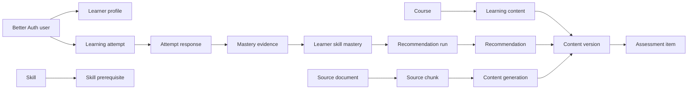

# Database Schema

MindBridge uses PostgreSQL and Drizzle ORM. Better Auth owns identity (`user`, `session`, `account`, `verification`); all application tables reference `user.id` as `text`.

The maintained declarations are:

- [`packages/db/src/schema/learning.ts`](../../packages/db/src/schema/learning.ts): curriculum, skill graph, learner profiles, classes.
- [`packages/db/src/schema/content.ts`](../../packages/db/src/schema/content.ts): versioned learning content, source documents, AI generations, review workflow.
- [`packages/db/src/schema/analytics.ts`](../../packages/db/src/schema/analytics.ts): assessment signals, mastery, recommendations, assignments and teacher feedback.

Each schema file links back to this document. `packages/db/src/schema/index.ts` exports the complete Drizzle schema.

## Commands

```bash
pnpm db:generate # Generate a Drizzle migration after schema changes.
pnpm db:migrate  # Apply generated migrations.
pnpm db:seed     # Load idempotent Vietnamese demo data after migrations.
```

The current domain migration is `packages/db/src/migrations/0001_fixed_emma_frost.sql`.

## Domain model



## Learning and classes

| Table | Purpose | Key invariants |
| --- | --- | --- |
| `course` | A Vietnamese course for a grade level. | Creator is a Better Auth user. |
| `skill` | Atomic learnable capability. | Unique `slug`; `mastery_threshold` is from 0 to 1. |
| `skill_prerequisite` | Directed edge from a skill to its prerequisite. | Unique pair; a skill cannot require itself. Detect longer cycles in application logic before inserting. |
| `course_skill` | Ordered skills taught by a course. | Unique skill and unique positive sequence per course. |
| `learner_profile` | Optional grade, proficiency, goal and locale per learner. | One profile per user; nullable level fields support incomplete data. |
| `classroom` / `classroom_enrollment` | Teacher-led cohort and learner membership. | A learner is enrolled once per classroom. |
| `classroom_group` / `classroom_group_member` | Optional smaller group inside a classroom. | Group names are unique in a classroom. |

## Content, sources and review

`learning_content` is the durable course-outline item. `content_version` is the actual lesson, quiz or practice payload. Consumers must use a **specific version ID**, not a mutable content item.

| Table | Purpose | Key invariants |
| --- | --- | --- |
| `learning_content` | Stable course item: `lesson`, `quiz`, or `practice`. | Linked to one course. |
| `content_version` | Versioned JSON body and metadata. | Version number is unique per content item. A Published version requires reviewer, review timestamp and publish timestamp. |
| `content_skill` | Skill coverage for a content version. | Coverage is `primary`, `supporting`, or `assessment`. |
| `course_content` | Course ordering and required/optional flag. | Unique positive position per course. |
| `content_review_event` | Append-only review audit event. | Records actor, transition and optional note. |
| `source_document` / `source_chunk` | Uploaded Markdown/PDF-text or pasted source, then source-addressable chunks. | Chunk ordinal is unique per document; character range is valid. |
| `content_generation` | AI request/run log. | Stores model, prompt version, typed input/output snapshots and errors. A failed generation can exist without a content version. |
| `content_source_reference` | Citation from generated content to a source chunk. | Unique per content version, chunk and reference kind. |

### Content lifecycle

```text
Draft → In review → Approved → Published → Archived
```

The schema guarantees that a `published` version has reviewer and publication metadata. The #14 API must enforce legal transitions, actor roles, and that only `published` versions are visible to learner recommendations or teacher assignments. Do not mutate published version bodies; create the next version instead.

`body` and `metadata` are `jsonb` because lesson/quiz/practice structures vary. Required metadata is validated at the oRPC procedure boundary: `gradeLevel`, `difficulty`, `learningObjectives`, `estimatedMinutes`, and `language`.

## Assessment and mastery

| Table | Purpose | Key invariants |
| --- | --- | --- |
| `assessment_item` / `assessment_option` | Version-bound quiz questions and options. | Positive, unique ordinal inside parent. |
| `learning_attempt` | A learner's activity against a content version. | Score is from 0 to 1; duration is non-negative. |
| `attempt_response` | Response and timing per question. | One response per attempt/question; `error_type` captures diagnostic category. |
| `mastery_evidence` | Immutable evidence contributing to a skill assessment. | Links to the response when applicable; stores signal, value, weight and Vietnamese reason. |
| `learner_skill_mastery` | Current deterministic projection of evidence. | Unique learner/skill row; score is from 0 to 1. |

An incorrect Loop response caused by weak Conditions must produce `mastery_evidence` for the Conditions skill with `signal_type = prerequisite_gap`. This is how the platform distinguishes prerequisite gaps from a misconception in the current skill.

## Recommendations and teacher actions

| Table | Purpose | Key invariants |
| --- | --- | --- |
| `recommendation_run` | Explainability snapshot for one engine execution. | Stores all input signals and engine version. |
| `recommendation` | Ordered suggested Published content version. | Has target skill, optional blocking prerequisite, Vietnamese explanation and unique rank per run. |
| `content_assignment` | Teacher assignment to exactly one classroom, group or learner. | Database check enforces a single recipient target. |
| `teacher_feedback` | Teacher feedback about recommendations, assignments or content. | Teacher actor is always recorded. |

The API is responsible for rejecting an assignment or recommendation if its target `content_version.status` is not `published`.

## Demo seed

`pnpm db:seed` is repeatable and creates:

- Vietnamese Python course for grade 6.
- Skill graph: Variables → Conditions → Loops.
- A teacher, two learners and a classroom.
- Published remediation, quiz and advanced-practice content versions.
- An incorrect Loop response that contributes prerequisite-gap evidence for Conditions.
- Different mastery profiles and an explainable remediation recommendation for the learner weak in Conditions.

This supports the P0 demonstration that two learners receive meaningfully different next steps.
